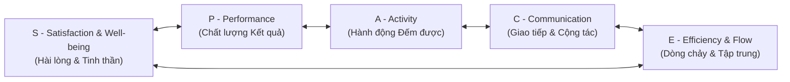

# 🌌 Khung Năng suất Toàn diện SPACE (The SPACE Framework)

> *"Năng suất của một kỹ sư phần mềm không thể đo lường bằng một con số duy nhất. Khi bạn cố gắng đơn giản hóa năng suất thành số lượng commits hay số dòng code, bạn không những không đo được gì, mà còn trực tiếp phá hủy tinh thần và sự sáng tạo của họ."* — **Tiến sĩ Nicole Forsgren & Tiến sĩ Margaret-Anne Storey**, nghiên cứu khoa học hợp tác giữa **GitHub, Microsoft Research & Đại học Victoria** (ACM Queue, 2021).

<!-- convention-summary-start -->

### SPACE Framework Summary

- **The Multi-Dimensional Paradigm**: Bác bỏ hoàn toàn các thước đo hoạt động đơn chiều (Activity-only metrics) gây kiệt sức; thiết lập 5 chiều kích cân bằng toàn diện:
  1. `S - Satisfaction & Well-being`: Sự thỏa mãn nghề nghiệp, văn hóa an toàn tâm lý và chống kiệt sức.
  2. `P - Performance`: Chất lượng kết quả đầu ra và tác động kinh doanh thực tế.
  3. `A - Activity`: Số lượng hành vi đếm được (PRs, commits, reviews).
  4. `C - Communication & Collaboration`: Tương tác đa chiều và hiệu quả chia sẻ tri thức.
  5. `E - Efficiency & Flow`: Dòng chảy tập trung sâu (Flow State), không bị ngắt quãng bởi họp hành.
- **The Triad Rule (Quy Tắc Bộ Ba)**: Mọi nỗ lực đo lường kỹ thuật bắt buộc phải kết hợp ít nhất 3 chiều kích khác nhau, trong đó bắt buộc phải có ít nhất 1 chiều đo lường định tính về Trải nghiệm (Satisfaction hoặc Flow).
- **The Levels Matrix**: Đo lường cân bằng qua 3 cấp độ: Cá nhân (Individual), Nhóm (Team), và Toàn hệ thống (System).
<!-- convention-summary-end -->

---

## 1. ⚠️ Cạm Bẫy Chết Người Của Thước Đo Hoạt Động Đơn Chiều

Trong nhiều năm, các nhà quản lý thường rơi vào cạm bẫy chọn những thứ dễ thấy nhất để đo lường:
- Đếm xem kỹ sư commit bao nhiêu lần trên GitHub.
- Đếm xem kỹ sư gõ bao nhiêu dòng code mỗi tuần.
- Theo dõi xem ai rời văn phòng muộn nhất.

### Hậu Quả Hủy Diệt Của Thước Đo Sai Lệch:
1. **Kiệt Sức & Nhảy Việc (Burnout & Attrition)**: Kỹ sư cảm thấy bị đối xử như những "cỗ máy gõ code", mất động lực sáng tạo và rời bỏ công ty.
2. **Kỹ Sư Đối Phó (Gaming the System - Định luật Goodhart)**: Thay vì suy nghĩ kỹ để viết 5 dòng code thuật toán tối ưu, họ copy-paste 200 dòng code rườm rà để đứng đầu bảng xếp hạng "Top Contributors".
3. **Phá Nát Chất Lượng**: Người ta thi nhau tạo các PR vụn vặt vô nghĩa để lấy số lượng, khiến các PR sửa lỗi kiến trúc quan trọng bị chìm nghỉm.

Khung SPACE ra đời để **lấy con người làm trung tâm** và tái định nghĩa năng suất một cách khoa học.

---

## 2. 🧩 5 Chiều Kích Cốt Lõi Của Khung SPACE



### ① S — Satisfaction & Well-being (Sự Hài Lòng & Tinh Thần Làm Việc)
- **Bản chất**: Kỹ sư cảm thấy hài lòng với công cụ làm việc của mình không? Môi trường có an toàn tâm lý (Psychological Safety) để họ dám thử nghiệm và dám thừa nhận sai lầm không? Họ có bị kiệt sức vì trực chiến (On-call) đêm hôm không?
- **Cách đo**: Khảo sát ẩn danh định kỳ, tỷ lệ giữ chân nhân tài, điểm eNPS (Employee Net Promoter Score).

### ② P — Performance (Chất Lượng Đầu Ra Của Hệ Thống)
- **Bản chất**: Phần mềm tạo ra có chạy mượt mà không? Người dùng có hài lòng không? Hệ thống có đem lại doanh thu cho công ty không?
- **Cách đo**: 4 chỉ số DORA, tỷ lệ crash của app, mức độ đáp ứng SLO/SLA, độ tin cậy của thuật toán.

### ③ A — Activity (Các Hoạt Động Kỹ Thuật Đếm Được)
- **Bản chất**: Các hành động cụ thể trong quá trình tạo tác phần mềm. Chỉ số này chỉ có giá trị khi được đặt bên cạnh các chiều kích khác.
- **Cách đo**: Số lượng PRs đã merge, số đợt deploy, số lượt build CI/CD, số lượng issue được đóng.

### ④ C — Communication & Collaboration (Giao Tiếp & Cộng Tác)
- **Bản chất**: Phần mềm là công việc tập thể. Một nhóm đoàn kết chia sẻ tri thức sẽ mạnh hơn một nhóm toàn những ngôi sao cô độc.
- **Cách đo**: Thời gian phản hồi review PR của đồng đội, chất lượng tài liệu kiến trúc trong `docs/`, tốc độ hòa nhập của kỹ sư mới (Onboarding speed).

### ⑤ E — Efficiency & Flow (Hiệu Suất Dòng Chảy & Tập Trung Sâu)
- **Bản chất**: Kỹ sư có được không gian làm việc liền mạch (Uninterrupted Focus Blocks) để đạt đến **Trạng thái Dòng chảy (Flow State)** hay bị xé nhỏ thời gian bởi 10 cuộc họp vô bổ mỗi ngày?
- **Cách đo**: Số giờ liên tục không bị họp ngắt quãng (Deep Work Hours), thời gian hoàn thành task (Cycle Time), thời gian chờ ở các hàng đợi.

---

## 3. 📊 Ma Trận SPACE: 3 Cấp Độ Đo Lường Đa Chiều

Để áp dụng SPACE một cách khoa học, nhóm nghiên cứu thiết lập ma trận giao thoa giữa **5 Chiều Kích** và **3 Cấp Độ Tổ Chức**:

| Chiều Kích SPACE | Cấp Độ Cá Nhân (Individual) | Cấp Độ Nhóm (Team / Squad) | Cấp Độ Hệ Thống (System / Org) |
| :--- | :--- | :--- | :--- |
| **S — Satisfaction** | Mức độ thỏa mãn với công việc; không bị quá tải stress. | Đánh giá về sự công bằng trong phân chia việc; độ an toàn tâm lý. | Tỷ lệ nghỉ việc (Turnover Rate); điểm đánh giá công cụ nội bộ. |
| **P — Performance** | Khả năng tự chủ giải quyết task; code ít bug hồi quy. | Tốc độ bàn giao tính năng; độ ổn định của module quản lý. | Mức độ tăng trưởng người dùng; sự ổn định tổng thể của toàn công ty. |
| **A — Activity** | Số lượng commit, số bài test đã viết. | Tần suất họp Standup; số PR được xử lý trong sprint. | Tần suất triển khai Production (DORA Deployment Frequency). |
| **C — Communication** | Tích cực tham gia thảo luận RFC; review có tâm cho bạn. | Tốc độ duyệt PR nội bộ nhóm; sự thấu hiểu ranh giới module. | Tài liệu kiến trúc được cập nhật đồng bộ (`ineffable-docs`). |
| **E — Efficiency** | Số giờ tập trung sâu không bị réo tên (Deep Work Hours). | Tỷ lệ Flow Efficiency ($\text{Touch Time} / \text{Lead Time}$). | Tốc độ chạy CI/CD Pipeline; thời gian provision môi trường test. |

---

## 4. 🧠 Lịch Trình Maker vs. Lịch Trình Manager (Paul Graham)

Một trong những lý do khiến chiều kích **E (Efficiency & Flow)** bị tàn phá nặng nề nhất là sự xung đột giữa hai kiểu lịch trình:

```
LỊCH TRÌNH MANAGER (Quản lý - Theo từng giờ)
┌──────┬──────┬──────┬──────┬──────┬──────┬──────┬──────┐
│ Họp  │ Chat │ Họp  │ Email│ Họp  │ Đồng │ Họp  │ Báo  │
│ 9:00 │ 10:00│ 11:00│ 12:00│ 13:00│ bộ   │ 15:00│ cáo  │
└──────┴──────┴──────┴──────┴──────┴──────┴──────┴──────┘
(Quản lý xem việc họp 1 tiếng là bình thường và linh hoạt nhảy giữa các phòng)

LỊCH TRÌNH MAKER (Kỹ sư - Theo khối 4 tiếng)
┌────────────────────────────┬────────────────────────────┐
│      KHỐI TẬP TRUNG SÁNG   │      KHỐI TẬP TRUNG CHIỀU  │
│    (Nạp Context Não Bộ     │    (Giải Quyết Logic Sâu   │
│     & Viết Thuật Toán)     │     & Kiểm Thử Toàn Phần)  │
└────────────────────────────┴────────────────────────────┘
```

> [!CAUTION]
> **Thảm Họa Ngắt Quãng**: Nếu nhà quản lý xếp một cuộc họp 30 phút vào giữa buổi sáng (lúc 10:30) và một cuộc họp vào giữa buổi chiều (lúc 14:30), họ đã **xé nát toàn bộ ngày làm việc của kỹ sư**. Não bộ không bao giờ kịp nạp xong ngữ cảnh để bước vào trạng thái Flow State!

---

## 5. 🛠️ Actionable Implementation Playbook cho Dự án Ineffable

### ① Quy Chế "Ngày Thứ Tư Tập Trung" (No-Meeting Focus Days)
- **Quy định cứng**: Vào thứ Ba và thứ Năm hàng tuần, **cấm tổ chức bất kỳ cuộc họp nội bộ nào** (ngoại trừ họp sự cố khẩn cấp).
- Kỹ sư được đảm bảo trọn vẹn 8 tiếng làm việc sâu (Deep Work) để dứt điểm các module nặng (`BOARDGAME`, `WATCH_PARTY`).

### ② Khảo Sát Sức Khỏe Kỹ Sư Định Kỳ Hàng Quý (DevEx Pulse Survey)
Cuối mỗi quý, toàn bộ kỹ sư điền phiếu khảo sát ẩn danh với 4 câu hỏi định tính:
1. *"Hệ thống công cụ và CI/CD của Ineffable có giúp bạn làm việc thuận tiện không?"* (Thang điểm 1-5).
2. *"Bạn có cảm thấy tự do và an toàn khi thừa nhận mình không biết một bài toán kỹ thuật không?"*
3. *"Tỷ lệ thời gian bạn phải trực chiến xử lý bug ngoài giờ trong quý qua có ở mức chấp nhận được không?"*
4. *"Điều gì đang kìm hãm dòng chảy tập trung của bạn nhiều nhất?"*

### ③ Bộ Ba Chỉ Số Cân Bằng (Triad Metric Rule) Trong Ineffable
Khi đánh giá tiến độ của một Module, Ineffable bắt buộc phải theo dõi bộ ba:
1. **Activity**: Tần suất merge PR của module.
2. **Performance**: Số lượng lỗi thoát ra môi trường staging.
3. **Efficiency / Flow**: Thời gian trung bình một PR phải chờ review ($< 24h$).

---

## 6. 📋 Audit Checklist & Bộ Câu Hỏi Tự Vấn (Self-Assessment)

- [ ] **Quy Tắc Đa Chiều**: Báo cáo năng suất của bạn có đang bị bó hẹp trong việc đếm commit hay số ticket đóng được (chỉ có Activity) không?
- [ ] **Bảo Vệ Không Gian Sâu**: Mỗi kỹ sư trong nhóm có được đảm bảo ít nhất **4 giờ tập trung liên tục** mỗi ngày không bị ngắt quãng bởi họp hành hay tin nhắn khẩn không?
- [ ] **Lắng Nghe Sự Thỏa Mãn (Satisfaction)**: Ban quản lý có biết các kỹ sư đang bức xúc nhất với công cụ nào trong hệ thống phát triển hiện tại không?
- [ ] **Văn Hóa Review Nhẹ Nhàng**: Việc review code có đang diễn ra với tinh thần xây dựng và hỗ trợ lẫn nhau hay biến thành nơi soi mói và thể hiện cái tôi?
- [ ] **Chống Cháy Sạch (Burnout Detection)**: Có thành viên nào trong team đang liên tục trả lời tin nhắn vào ban đêm hoặc ngày cuối tuần trong nhiều tuần liền không? (Nếu có $\implies$ Cần can thiệp điều chỉnh khối lượng công việc ngay lập tức!).
