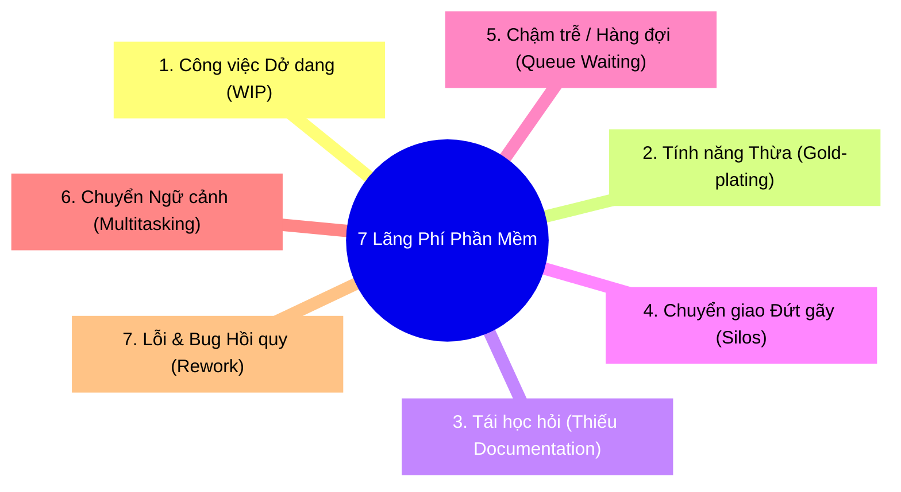

# ⏱️ Lead Time vs. Cycle Time & Hiệu suất Dòng chảy (Flow Efficiency)

> *"Phần mềm không chậm vì lập trình viên gõ phím chậm. Phần mềm chậm vì các đoạn mã phải nằm chết dí trong hàng đợi để chờ đợi con người và quy trình cấp phép."* — Tinh hoa phương pháp luận **Lean Software Development** của Mary & Tom Poppendieck.

<!-- convention-summary-start -->

### Lead Time vs. Cycle Time Summary

- **Distinction of Timers**:
  - `Lead Time (Customer's Clock)`: Thời gian từ lúc ý tưởng/bug được ghi nhận đến khi tính năng vận hành trên Production.
  - `Cycle Time (Engineer's Clock)`: Thời gian từ khi kỹ sư bắt đầu chạm vào task (`In Progress`) đến khi code sẵn sàng phát hành.
  - `Touch Time (Active Work)`: Thời gian kỹ sư thực sự suy nghĩ và gõ code tạo ra giá trị.
- **The Flow Efficiency Metric**:
  $$\text{Flow Efficiency} = \frac{\text{Touch Time}}{\text{Total Lead Time}} \times 100\%$$
- **The 85% Waiting Trap**: Trong hầu hết các tổ chức phần mềm, Flow Efficiency chỉ dao động từ **$5\% - 15\%$**. Tức là $85\% - 95\%$ thời gian của một tính năng là **thời gian chết vô nghĩa trong hàng đợi (Queue Waiting Time)**.
- **The 7 Wastes of Software**: Handoffs, Delays, Partially Done Work, Task Switching, Extra Features, Defects, Relearning.
<!-- convention-summary-end -->

---

## 1. 📐 Bản Đồ Thời Gian: Phân Định Rạch Ròi 3 Đồng Hồ Bấm Giờ

```
  [1. Khách hàng Báo Bug / Product Nêu Ý Tưởng]
  │
  ├─► Nằm chờ trong Backlog để phân tích (Wait: 14 ngày)
  │
  [2. Kỹ sư kéo task vào "In Progress"] ────────┐
  │                                             │
  ├─► Nghiên cứu schema & viết code (Làm: 2 ngày)│
  ├─► Nằm chờ đồng đội Review PR (Wait: 3 ngày) │ ──► CYCLE TIME
  ├─► Sửa code theo review & test (Làm: 1 ngày)  │     (Tổng: 7 ngày)
  ├─► Chờ pipeline CI/CD chạy xong (Wait: 1 ngày)│     (Làm: 3 ngày, Chờ: 4 ngày)
  │                                             │
  [3. Code sẵn sàng phát hành (Merged to Main)] ─┘
  │
  ├─► Nằm chờ đợt release định kỳ cuối tháng (Wait: 7 ngày)
  │
  [4. Triển khai Production & Khách hàng Trải nghiệm]
  │
  └─────────────────────────────────────────────► TỔNG LEAD TIME = 28 ngày!
```

### Bảng So Sánh Chi Tiết 3 Khái Niệm:

| Tiêu Chí | Lead Time (Thời Gian Chờ Toàn Cục) | Cycle Time (Thời Gian Xử Lý Kỹ Thuật) | Touch Time (Thời Gian Làm Việc Thực) |
| :--- | :--- | :--- | :--- |
| **Đồng hồ bấm giờ của ai?** | **Khách hàng / Stakeholder** | **Đội ngũ Kỹ thuật (Dev Team)** | **Cá nhân Kỹ sư** |
| **Bắt đầu khi nào?** | Khi ticket/issue được tạo trong backlog. | Khi task được kéo vào `In Progress`. | Khi IDE được mở và bắt đầu commit logic. |
| **Kết thúc khi nào?** | Khi giá trị đã chạy trên Production. | Khi PR được merge và test thành công. | Khi hoàn thành đoạn code/test. |
| **Bản chất đo lường** | Khả năng phản ứng của doanh nghiệp. | Năng lực thực thi của team kỹ thuật. | Năng suất cá nhân thuần túy. |

---

## 2. 🧮 Công Thức Hiệu Suất Dòng Chảy (Flow Efficiency)

$$\text{Flow Efficiency} = \frac{\text{Thời gian gia tăng giá trị thực (Touch Time)}}{\text{Tổng thời gian lưu chuyển (Lead Time)}} \times 100\%$$

### Bài Toán Đối Kháng: 2 Cách Để Rút Ngắn 50% Thời Gian Bàn Giao

Xét dự án mẫu ở trên với $\text{Lead Time} = 28 \text{ ngày}$ và $\text{Touch Time} = 3 \text{ ngày}$ (Flow Efficiency $\approx 10.7\%$):

```
Cách 1: Ép Dev làm việc gấp đôi (Áp lực phi nhân tính)
- Dev cày ngày cày đêm, giảm Touch Time từ 3 ngày xuống 1.5 ngày.
- Lead Time mới: 28 - 1.5 = 26.5 ngày!
- Kết quả: Tiết kiệm được vỏn vẹn 5% thời gian toàn cục, dev kiệt sức, phát sinh bug.

Cách 2: Triệt tiêu thời gian chờ đợi ở các hàng đợi (Tư duy Lean)
- Bỏ cơ chế duyệt backlog rườm rà (giảm từ 14 ngày xuống 2 ngày).
- Đặt SLA review PR < 24h (giảm từ 3 ngày xuống 0.5 ngày).
- Áp dụng Continuous Delivery (deploy ngay khi merge, giảm 7 ngày chờ release xuống 0).
- Lead Time mới: 2 + (2 + 0.5 + 1) + 0 = 5.5 ngày!
- Kết quả: Tốc độ bàn giao tăng vọt gấp 5 lần (500%) mà không cần kỹ sư phải gõ phím nhanh hơn dù chỉ một giây!
```

> [!IMPORTANT]
> **Quy tắc Vàng**: Trong sản xuất phần mềm, **việc tối ưu hóa thời gian chờ (Queue Time)** luôn mang lại hiệu quả kinh tế và tốc độ cao gấp hàng chục lần so với việc cố gắng ép kỹ sư rút ngắn thời gian gõ code (Touch Time).

---

## 3. 🗑️ 7 Loại Lãng Phí trong Kỹ Nghệ Phần Mềm (The 7 Lean Wastes)

Dựa trên nguyên lý của Toyota Production System (TPS), Mary & Tom Poppendieck đã định nghĩa 7 loại lãng phí (Muda) tàn phá Flow Efficiency:



1. **Công việc dở dang (Partially Done Work)**: Code chưa merge, PR chưa review, tài liệu chưa duyệt. Không đem lại một đồng doanh thu nào nhưng làm rối hệ thống.
2. **Tính năng thừa (Extra Features)**: $64\%$ tính năng phần mềm hiếm khi hoặc không bao giờ được người dùng chạm đến (nghiên cứu của Standish Group).
3. **Tái học hỏi (Relearning)**: Giải pháp kỹ thuật đã làm nhưng không viết tài liệu hoặc không ghi lại ADR, sau 6 tháng người mới lại phải nghiên cứu lại từ con số không.
4. **Chuyển giao đứt gãy (Handoffs)**: Dev ném code qua cho QA, QA ném qua cho Ops. Mỗi lần ném qua hàng rào là mất mát $50\%$ ngữ cảnh logic.
5. **Chậm trễ (Delays)**: Chờ sếp duyệt spec, chờ server staging, chờ review PR.
6. **Chuyển đổi nhiệm vụ (Task Switching)**: Ôm cùng lúc 3 dự án, não bộ bị xả cache liên tục.
7. **Lỗi hồi quy (Defects)**: Phát hiện bug muộn buộc phải đập đi sửa lại (Rework) tốn kém gấp 100 lần so với sửa ngay lúc viết code.

---

## 4. 🏢 Nghiên cứu Tình huống Thực tế (Industry Case Studies)

### Case Study: HP LaserJet Firmware Division (Hành trình Biến Đổi Kỳ Diệu)
Được ghi chép chi tiết trong cuốn sách nổi tiếng *A Practical Approach to Large-Scale Agile Development* của Gary Gruver:
- **Hiện trạng ban đầu**: Đội ngũ firmware gồm 400 kỹ sư của HP chỉ dành **$5\%$ thời gian để phát triển tính năng mới**. $95\%$ thời gian còn lại bị chôn vùi trong việc port code giữa các dòng máy in, tích hợp nhánh git thủ công, debug môi trường và chờ đợi các đợt test kéo dài 6 tuần.
- **Giải pháp chuyển đổi**:
  1. Loại bỏ các nhánh git phân nhánh phức tạp, chuyển sang **Trunk-Based Development**.
  2. Xây dựng trang trại máy in ảo hóa và tự động hóa toàn diện CI/CD.
  3. Mọi commit phải vượt qua hàng nghìn bài kiểm thử tự động trong vòng 2 giờ.
- **Kết quả**:
  - Tỷ lệ thời gian tạo giá trị mới tăng từ **$5\%$ lên $40\%$** (tăng gấp 8 lần).
  - Chi phí phát triển trên mỗi dòng máy in giảm $78\%$.
  - Tốc độ phát hành bản firmware mới rút ngắn từ hàng năm xuống còn vài tuần.

---

## 5. 🛠️ Actionable Implementation Playbook cho Dự án Ineffable

### ① Quy Chuẩn SLA cho Thời Gian Chờ (Queue Time SLA)
Để đạt Flow Efficiency $> 40\%$, Ineffable áp dụng các quy chuẩn thời gian khắt khe:

| Giai Đoạn Hàng Đợi | Ngưỡng Thời Gian Tối Đa (SLA) | Hành Động Khi Vượt Ngưỡng |
| :--- | :---: | :--- |
| **PR Chờ Review (`In Review`)** | **$\le 24$ giờ** | Bật thông báo khẩn cấp trên Slack/Discord; kích hoạt cặp đôi pair-review. |
| **Pipeline CI/CD Chạy** | **$\le 8$ phút** | Tối ưu cache Docker/pnpm; song song hóa job typecheck và test. |
| **Bug Triaging (`status:todo`)** | **$\le 48$ giờ** | Đánh giá phân loại theo Capacity (`BUGFIX`) và gán priority rõ ràng. |

### ② Đo Lường Chuỗi Giá Trị Với Ineffable-MCP
- Sử dụng các API tools của MCP để giám sát trạng thái task trên GitHub Project Board #2.
- Tính toán chu kỳ sống của Issue:
  $$\text{Cycle Time} = \text{closed\_at} - \text{started\_at}$$
- Khi một task có `Cycle Time` kéo dài bất thường so với kích thước ước lượng, tiến hành phân tích Retro xem thời gian bị ngâm ở khâu nào (Active coding hay Wait for review).

---

## 6. 📋 Audit Checklist & Bộ Câu Hỏi Tự Vấn (Self-Assessment)

- [ ] **Đo Lường Flow Efficiency**: Bạn có ước tính được Flow Efficiency của team mình trong tháng qua đạt trên $20\%$ hay vẫn đang dưới $10\%$?
- [ ] **Xóa Bỏ Batch Releases**: Dự án có đang gộp nhiều tính năng lại thành một đợt phát hành lớn (Big Bang Release) khiến hàng loạt task phải nằm chờ dài ngày không?
- [ ] **Tốc Độ Review**: Lập trình viên trong team mất bao lâu để nhận được nhận xét đầu tiên sau khi mở một Pull Request? (Lý tưởng: $< 4 \text{ giờ}$).
- [ ] **Mức Độ Sẵn Sàng**: Code sau khi merge vào nhánh chính có thể release thẳng lên môi trường thực tế bất kỳ lúc nào hay phải trải qua một tuần "đóng băng code để test"?
- [ ] **Thái Độ Với Thời Gian Chờ**: Khi một task bị chậm tiến độ, câu hỏi đầu tiên bạn đặt ra là *"Ai làm chậm?"* (tư duy chỉ trích con người) hay *"Task này đã bị ngâm ở hàng đợi nào lâu nhất?"* (tư duy cải tiến hệ thống)?
