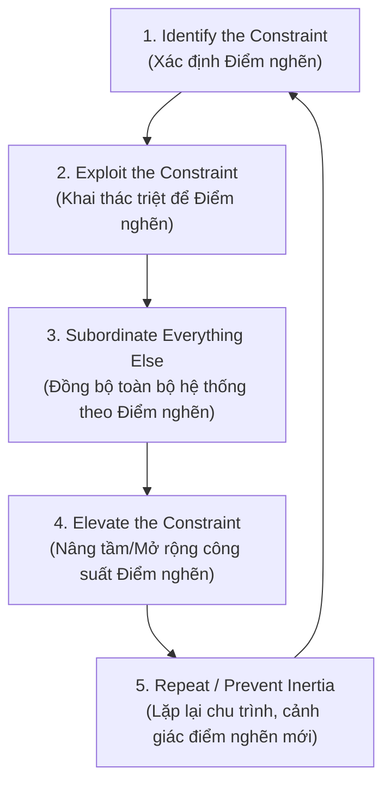

# ⛓️ Thuyết Điểm Nghẽn (Theory of Constraints - TOC)

> *"Bất kỳ sự tối ưu hóa nào diễn ra ngoài điểm nghẽn đều chỉ là ảo tưởng."* — **Tiến sĩ Eliyahu M. Goldratt**, tác giả tiểu thuyết quản trị kinh điển *The Goal* (1984) và nền tảng của phong trào DevOps hiện đại qua *The Phoenix Project*.

<!-- convention-summary-start -->

### Theory of Constraints Summary

- **Core Axiom**: Sức mạnh của một hệ thống kỹ thuật luôn luôn bị giới hạn bởi mắt xích yếu nhất (The Bottleneck / The Constraint). Tối ưu hóa cục bộ tại các mắt xích không nghẽn chỉ tạo ra thêm lãng phí và tắc nghẽn hàng đợi.
- **The 5 Focusing Steps**:
  1. `Identify`: Nhận diện mắt xích có hàng đợi dài nhất và thời gian chờ (Wait Time) cao nhất.
  2. `Exploit`: Tối đa hóa hiệu suất của điểm nghẽn, tuyệt đối không để điểm nghẽn lãng phí thời gian vào việc phụ.
  3. `Subordinate`: Buộc toàn bộ các khâu phía trước (Upstream) phải hạ nhịp độ sản xuất bằng đúng tốc độ xử lý của điểm nghẽn.
  4. `Elevate`: Đầu tư tự động hóa, công cụ, hoặc tăng nhân lực chuyên trách để mở rộng công suất của điểm nghẽn.
  5. `Repeat`: Khi điểm nghẽn cũ bị phá vỡ, nó sẽ di chuyển sang vị trí mới. Không bao giờ để sự tự mãn gây quán tính.
- **Drum-Buffer-Rope (DBR)**: Điểm nghẽn đóng vai trò là chiếc trống (Drum) đánh nhịp cho toàn bộ quy trình; Buffer bảo vệ điểm nghẽn khỏi đói việc; Rope ngăn chặn upstream nhồi nhét thêm code.
<!-- convention-summary-end -->

---

## 1. 🔍 Nền tảng Lý thuyết & Ảo tưởng Tối ưu Cục bộ (Local Optimization Fallacy)

Mọi quy trình kỹ nghệ phần mềm đều là một **Dòng chảy Giá trị (Value Stream)** tuần tự hoặc bán tuần tự gồm nhiều công đoạn:

$$\text{Yêu cầu (Product)} \xrightarrow{v_1} \text{Thiết kế (Architecture)} \xrightarrow{v_2} \text{Viết Mã (Coding)} \xrightarrow{v_3} \text{Kiểm thử & Review (QA/PR)} \xrightarrow{v_4} \text{Triển khai (Deploy)}$$

*Giả định năng lực xử lý ($v$) của từng công đoạn trong một tuần:*
- Product chốt spec: $v_1 = 30 \text{ features/tuần}$
- Dev viết mã: $v_2 = 25 \text{ features/tuần}$
- **Code Review & Testing: $v_3 = 5 \text{ features/tuần}$ (ĐIỂM NGHẼN DUY NHẤT)**
- CI/CD Deploy: $v_4 = 40 \text{ features/tuần}$

```
 [Product: 30] ──► [Dev: 25] ──► [Review & QA: 5] ──► [Deploy: 40] ──► (Thị trường)
                                       ▲
                                       │ 🔴 THE BOTTLENECK
                                       └─ Năng lực toàn hệ thống = 5 features/tuần!
```

### Bi kịch của việc Tối ưu Cục bộ:
Nếu nhà quản lý mua thêm các công cụ AI coding thế hệ mới giúp lập trình viên tăng tốc độ viết code lên gấp đôi ($v_2 = 50 \text{ features/tuần}$):
- **Sản lượng ra thị trường có tăng không?** $\longrightarrow$ **Hoàn toàn KHÔNG!** Vẫn giữ nguyên ở mức **5 features/tuần**.
- **Điều gì thực sự xảy ra?** Cột `In Review` và `QA Testing` sẽ bị ném vào 50 tính năng mỗi tuần trong khi chỉ nuốt nổi 5 tính năng. Hàng đợi phình to gấp 10 lần, merge conflict bùng nổ, bug bị bỏ sót do reviewer quá tải, và sự bức xúc của toàn bộ đội ngũ leo thang.

> [!CAUTION]
> **Định luật Goldratt**: Bất kỳ cải tiến nào không tác động trực tiếp vào Điểm nghẽn hiện tại đều **hoàn toàn vô nghĩa về mặt kinh tế**, thậm chí còn trực tiếp tàn phá dòng chảy của hệ thống.

---

## 2. 🔄 Chu trình 5 Bước Tập Trung (The 5 Focusing Steps)

Quy trình chuẩn mực để liên tục bẻ gãy các điểm nghẽn kỹ thuật:



### Bước 1: Xác định Điểm nghẽn (Identify)
- Điểm nghẽn trong kỹ nghệ phần mềm là nơi **WIP chất đống cao nhất** và **thời gian chờ (Wait Time) lâu nhất**.
- *Dấu hiệu nhận biết*: Cột nào trên bảng Kanban có số lượng ticket nhiều nhất và nằm bất động lâu nhất? Kỹ sư nào trong team luôn trong tình trạng "ngập đầu trong mention" và là single point of failure?

### Bước 2: Khai thác Triệt để Điểm nghẽn (Exploit)
- Đảm bảo điểm nghẽn **không bao giờ bị lãng phí một phút giây nào vào những việc không quan trọng**.
- *Ví dụ*: Nếu Senior Architect là điểm nghẽn duy nhất được phép review PR kiến trúc, tuyệt đối không để người đó phải review những lỗi format code, syntax hay thiếu test cơ bản. Hãy để linter, prettier và AI (Ineffable-MCP) chặn đứng những lỗi này từ vòng gửi xe. Điểm nghẽn chỉ được dành 100% trí lực cho những quyết định sống còn.

### Bước 3: Đồng bộ Toàn bộ Hệ thống (Subordinate)
- Đây là bước khó nhất về mặt tâm lý nhưng mang tính quyết định: **Buộc các mắt xích không nghẽn phải giảm tốc độ để khớp với nhịp của điểm nghẽn**.
- Khi cột Review đang kẹt 10 PRs, các kỹ sư khác **phải ngừng viết code mới**. Họ phải chuyển sang hỗ trợ review, viết tài liệu, hoặc dọn dẹp hệ thống. Viết thêm code lúc này là hành vi gây hại cho dự án.

### Bước 4: Nâng tầm Điểm nghẽn (Elevate)
- Khi đã khai thác tối đa mà điểm nghẽn vẫn không đáp ứng đủ nhu cầu, lúc này mới đầu tư tài nguyên:
  - Tuyển thêm Senior / QA chuyên trách.
  - Tự động hóa bộ test e2e, nâng cấp cấu hình máy runner CI/CD để giảm thời gian build từ 30 phút xuống 3 phút.
  - Áp dụng kiến trúc Microservices / Submodules độc lập để phân tán quyền review.

### Bước 5: Lặp lại và Chống Quán tính (Repeat)
- Ngay khi khâu Review được nâng cấp và không còn là điểm nghẽn, nút thắt sẽ lập tức di chuyển sang khâu khác (ví dụ: khâu Deploy lên Staging hoặc khâu Clarify yêu cầu của Product).
- Phải lập tức quay lại Bước 1, không được để thói quen và quy trình cũ biến thành rào cản mới.

---

## 3. 🥁 Mô hình Drum - Buffer - Rope (DBR) trong Phát triển Phần mềm

Cơ chế điều phối luồng sản xuất nổi tiếng của TOC được ánh xạ hoàn hảo vào quy trình phát triển phần mềm hiện đại:

```
                ┌───────────────────────────────────────────────┐
                │             THE ROPE (Dây kéo nhịp)           │
                └───────────────────────┬───────────────────────┘
                                        │ (Tín hiệu Pull)
  ┌──────────────┐              ┌───────▼──────┐              ┌──────────────┐
  │  Product /   │ ───────────► │  THE BUFFER  │ ───────────► │   THE DRUM   │
  │  Dev Queue   │              │ (Kho dự trữ) │              │ (Điểm nghẽn) │
  └──────────────┘              └──────────────┘              └──────┬───────┘
                                                                     │
                                                                     ▼
                                                              [Khâu Tiếp Theo]
```

1. **The Drum (Chiếc Trống)**: Chính là Điểm nghẽn. Nhịp đập của chiếc trống này quyết định tốc độ bàn giao của toàn bộ dự án. Mọi ước lượng tiến độ cam kết với khách hàng phải tính theo nhịp của chiếc trống này.
2. **The Buffer (Vùng Đệm Dự Phòng)**: Một số lượng nhỏ task đã được chuẩn bị kỹ lưỡng (Ready for Review hoặc Ready for Test) luôn nằm sẵn trước điểm nghẽn, đảm bảo điểm nghẽn không bao giờ bị "chết đói" (Starvation) vì thiếu nguyên liệu.
3. **The Rope (Sợi Dây Buộc)**: Sợi dây kết nối giữa điểm nghẽn và đầu vào (Product Backlog). Khi điểm nghẽn xử lý xong 1 task, nó mới giật sợi dây để cho phép khâu trước đó nạp thêm đúng 1 task mới vào luồng làm việc.

---

## 4. 🚩 Các Điểm Nghẽn Điển Hình trong Đội Ngũ Kỹ Thuật

| Điểm Nghẽn (Constraint) | Triệu Chứng Điển Hình | Giải Pháp Khai Thác (Exploit) | Giải Pháp Nâng Tầm (Elevate) |
| :--- | :--- | :--- | :--- |
| **"Hero Developer" (Senior duy nhất)** | 80% PRs chờ 1 người duyệt; mọi câu hỏi kiến trúc đều đổ về 1 người. | Cấm gán Senior vào các task fix bug lặt vặt; tổ chức "Office Hours" 1 giờ/ngày thay vì ngắt quãng liên tục. | Viết Architecture Decision Records (ADRs); ủy quyền review theo module domain; pair programming đào tạo Mid-level. |
| **Môi trường Test Thủ công (Manual QA)** | Code xong trong 2 ngày nhưng nằm chờ QA test mất 2 tuần; release luôn bị dồn vào cuối sprint. | Yêu cầu Dev gửi kèm video demo và test case rõ ràng; QA chỉ test exploratory edge cases. | Đầu tư viết tự động hóa Playwright/Cypress; thiết lập môi trường Preview Deployment tự động cho mỗi PR. |
| **Hạ Tầng CI/CD Chậm & Chập chờn (Flaky CI)** | Pipeline chạy mất 45 phút; test hay fail ngẫu nhiên buộc dev phải bấm retry 3 lần. | Tách pipeline: lint/unit test chạy trong 2 phút để merge nhanh, test nặng chạy async về đêm. | Tối ưu hóa Docker layer caching, song song hóa test execution (matrix runners), diệt sạch flaky tests. |

---

## 5. 🏢 Nghiên cứu Tình huống Thực tế (Industry Case Studies)

### Case Study: Sự Chuyển dịch của Amazon (Từ Khối Monolith Khổng Lồ sang Two-Pizza Teams)
Vào đầu những năm 2000, Amazon sở hữu một hệ thống monolith mang tên "Obidos". Điểm nghẽn lớn nhất không nằm ở kỹ năng lập trình của kỹ sư, mà nằm ở **giai đoạn phối hợp phát hành (Release Coordination)**:
- Hàng trăm kỹ sư phải xếp hàng chờ đến lượt merge code vào cây monolith. Một lỗi nhỏ của team này sẽ làm tê liệt toàn bộ bản build của công ty suốt nhiều ngày.
- **Áp dụng TOC**: Jeff Bezos nhận diện rằng điểm nghẽn chính là sự phụ thuộc chéo giữa các nhóm. Ông áp dụng giải pháp triệt để:
  1. Chia tách hệ thống thành các Microservices độc lập giao tiếp qua API công khai.
  2. Tổ chức lại nhân sự thành các **Two-Pizza Teams** (đội ngũ đủ nhỏ để ăn vừa 2 chiếc bánh pizza, khoảng 6 - 8 người) hoàn toàn tự chủ từ khâu viết code, test đến tự deploy dịch vụ của mình.
- **Kết quả**: Điểm nghẽn tích hợp bị xóa bỏ hoàn toàn. Tần suất deploy của Amazon tăng từ vài tuần một lần lên hàng triệu lượt deploy mỗi năm.

---

## 6. 🛠️ Actionable Implementation Playbook cho Dự án Ineffable

### ① Quy Trình Tầm Soát Điểm Nghẽn (Bottleneck Hunting Protocol)
Hàng tuần, Tech Lead thực hiện rà soát thông qua MCP tools hoặc GitHub Projects:
1. Kiểm tra thống kê thời gian lưu tại các cột trên Project Dashboard.
2. Nếu số lượng item ở trạng thái `status:in-review` vượt quá ngưỡng:
   ```bash
   # Lập tức thực hiện lệnh can thiệp Subordination:
   1. Đóng băng việc kéo task mới từ Ready/Todo.
   2. Kích hoạt toàn bộ reviewer tập trung duyệt dứt điểm các PR đang chờ.
   ```

### ② Cơ Chế Bảo Vệ Điểm Nghẽn Bằng AI Automation (Ineffable-MCP)
Để không lãng phí thời gian review thủ công của con người:
- Bắt buộc chạy `typecheck_paths` và `lint_paths` trước khi mở PR.
- Sử dụng MCP Server tự động kiểm tra xem các thay đổi có vi phạm các quy tắc thiết kế trong `docs/conventions/` hay không.
- Chỉ khi bản code vượt qua 100% các tiêu chuẩn kiểm thử tự động thì con người mới tiến hành review logic nghiệp vụ.

---

## 7. 📋 Audit Checklist & Bộ Câu Hỏi Tự Vấn (Self-Assessment)

- [ ] **Nhận diện Điểm nghẽn**: Bạn có chỉ mặt đặt tên được điểm nghẽn số 1 kìm hãm tốc độ của team trong tuần này là gì không? (Nếu câu trả lời là "chúng tôi tắc ở mọi nơi" $\implies$ Bạn chưa thực sự hiểu hệ thống).
- [ ] **Bảo vệ Điểm nghẽn**: Điểm nghẽn của team có đang bị lãng phí thời gian vào những việc mà máy móc hoặc nhân sự khác có thể làm thay không?
- [ ] **Kỷ luật Hạ nhịp (Subordination)**: Khi khâu sau bị nghẽn, các khâu trước có chủ động giảm tốc độ sản xuất code để chung tay dọn dẹp hàng đợi không?
- [ ] **Thời gian Pipeline**: Pipeline CI/CD từ lúc push commit đến khi có kết quả test mất bao nhiêu phút? (Mục tiêu: $< 10 \text{ phút}$).
- [ ] **Độc lập Module**: Các module (`BOARDGAME`, `CHAT`, `WATCH_PARTY`) có thể được build, test và deploy độc lập mà không cần phải chờ đợi lẫn nhau không?
