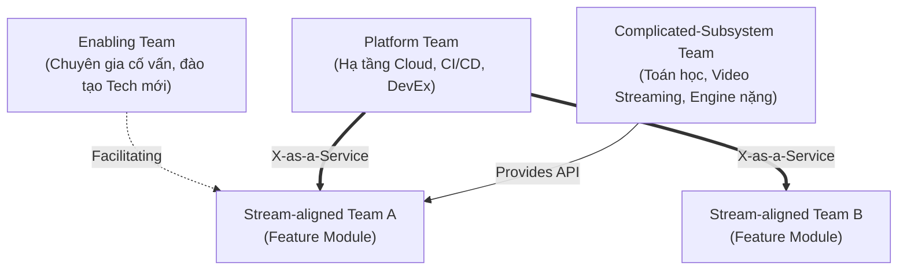

# 🏢 Định luật Conway & Thao tác Đảo ngược Conway (Conway's Law)

> *"Bất kỳ tổ chức nào thiết kế một hệ thống đều tất yếu sẽ sản sinh ra một thiết kế kiến trúc là bản sao chép chính xác cấu trúc giao tiếp của chính tổ chức đó."* — **Melvin Conway** (*Datamation*, 1968).

<!-- convention-summary-start -->

### Conway's Law Summary

- **Socio-Technical Congruence**: Kiến trúc phần mềm và cơ cấu tổ chức con người là hai mặt của cùng một đồng xu. Bạn không thể thay đổi kiến trúc hệ thống (như chuyển từ Monolith sang Microservices) nếu không tái cấu trúc cách các nhóm làm việc giao tiếp với nhau.
- **The Silo Anti-Pattern**: Việc phân chia phòng ban theo công nghệ (Frontend Team, Backend Team, DBA Team) sẽ tự động sản sinh ra kiến trúc 3 tầng (3-tier) cồng kềnh, nghẽn mạng và gia tăng ma sát giao tiếp.
- **The Inverse Conway Maneuver**: Chủ động tái thiết kế cơ cấu đội ngũ theo các miền nghiệp vụ độc lập (Bounded Contexts) để ép kiến trúc phần mềm tự động phân rã thành các module sạch sẽ, lỏng lẻo (Loosely Coupled).
- **Team Topologies Framework**: 4 kiểu đội ngũ (Stream-aligned, Platform, Enabling, Complicated-subsystem) nhằm tối ưu hóa tải nhận thức (Cognitive Load).
<!-- convention-summary-end -->

---

## 1. 📜 Nguồn Gốc & Bằng Chứng Thực Nghiệm

Năm 1967, lập trình viên Melvin Conway đúc kết một quan sát sâu sắc: **Giao diện giữa các module phần mềm thực chất chỉ là tấm gương phản chiếu giao diện giao tiếp giữa các nhóm kỹ sư**.

### Nghiên Cứu Thực Nghiệm của MIT & Harvard (2012)
Alan MacCormack, Carliss Baldwin và John Rusnak đã tiến hành một nghiên cứu quy mô lớn so sánh các hệ thống phần mềm thương mại (do các công ty có tổ chức tập trung phát triển) với các dự án mã nguồn mở tương đương (Linux, Apache, do cộng đồng phân tán toàn cầu phát triển).
- **Kết quả thực nghiệm chứng minh rực rỡ**:
  - Các dự án mã nguồn mở do các nhóm làm việc phân tán, độc lập tạo ra luôn sở hữu **kiến trúc mô-đun hóa cao hơn gấp $3 - 5$ lần**, ít phụ thuộc chéo và có ranh giới API rõ ràng hơn.
  - Các công ty có trụ sở làm việc tập trung, các nhóm ngồi chung phòng luôn vô tình tạo ra các khối mã nguồn đan xen chặt chẽ (Tight Coupling), vì các kỹ sư dễ dàng "nói miệng" với nhau để chèn thêm logic bắc cầu mà không cần định nghĩa API chuẩn.

```
CẤU TRÚC GIAO TIẾP CON NGƯỜI                KIẾN TRÚC MÃ NGUỒN PHẦN MỀM
┌───────────┐      ┌───────────┐            ┌───────────┐      ┌───────────┐
│  Team A   │◄────►│  Team B   │   ════►    │ Module A  │◄────►│ Module B  │
└─────┬─────┘      └─────┬─────┘            └─────┬─────┘      └─────┬─────┘
      │ (Giao tiếp       │ (Giao tiếp             │ (Gọi hàm         │ (Gọi hàm
      ▼  thưa thớt)      ▼  thưa thớt)            ▼  lỏng lẻo)       ▼  lỏng lẻo)
┌──────────────────────────────┐            ┌──────────────────────────────┐
│            Team C            │            │           Module C           │
└──────────────────────────────┘            └──────────────────────────────┘
```

---

## 2. 💣 Thảm Họa Kiến Trúc Tự Phát Từ Cấu Trúc Phòng Ban Cũ (Horizontal Silos)

Nếu một doanh nghiệp tổ chức nhân sự theo "chuyên môn kỹ thuật nằm ngang":

```
  [Phòng Giao Diện (Frontend Team)]  ──► Chỉ quan tâm HTML/CSS/React
                 │ (Bất đồng, trễ nải)
  [Phòng Xử Lý (Backend Team)]       ──► Chỉ quan tâm Node.js/Go/Java
                 │ (Trình ký ticket)
  [Phòng Cơ Sở Dữ Liệu (DBA Team)]   ──► Chỉ quan tâm Table/Index/Lock
```

### Hậu Quả Kỹ Thuật Tất Yếu:
1. **Để hoàn thành một tính năng nhỏ** (ví dụ: thêm trường `bio` vào hồ sơ người dùng):
   - Dev Frontend phải viết ticket xin Backend thêm API.
   - Dev Backend phải viết đơn xin DBA tạo thêm cột trong database.
   - DBA bận việc khác ngâm ticket 5 ngày. Backend code mất 1 ngày. Frontend tích hợp mất 2 ngày.
   - Tổng cộng: Mất 2 tuần và 15 cuộc họp chỉ để hiển thị một chuỗi text lên màn hình!
2. **Kiến trúc phân mảnh, ranh giới mờ nhạt**: Logic nghiệp vụ bị phân tán khắp nơi (một nửa nằm trong frontend validation, một nửa nằm trong controller backend, một phần bị nhét vào Stored Procedure của database).

---

## 3. 🔄 Thao Tác Đảo Ngược Conway (The Inverse Conway Maneuver)

Thay vì để cơ cấu tổ chức ngẫu nhiên bóp méo kiến trúc phần mềm, các tổ chức tiên tiến thực hiện **Thao tác Đảo ngược Conway**:

> [!IMPORTANT]
> **Quy Tắc Vàng Của Inverse Conway**:  
> **Hãy thiết kế Kiến trúc Hệ thống lý tưởng mong muốn trước $\longrightarrow$ Sau đó sắp xếp cơ cấu Đội ngũ con người sao cho đường biên giao tiếp của họ khớp chính xác với kiến trúc đó.**

```
Bước 1: Thiết kế Kiến trúc Mong muốn (Domain-Driven Design)
┌──────────────────┐    ┌──────────────────┐    ┌──────────────────┐
│  Boardgame Core  │    │   Chat Service   │    │  Social Profile  │
│ (Bounded Context)│    │ (Bounded Context)│    │ (Bounded Context)│
└──────────────────┘    └──────────────────┘    └──────────────────┘
         ▲                       ▲                       ▲
         │                       │                       │
Bước 2: Xây dựng Đội ngũ Tương ứng (Cross-Functional Stream Teams)
┌──────────────────┐    ┌──────────────────┐    ┌──────────────────┐
│ Team Boardgame   │    │    Team Chat     │    │   Team Social    │
│ (Fullstack+QA+PO)│    │ (Fullstack+QA+PO)│    │(Fullstack+QA+PO) │
└──────────────────┘    └──────────────────┘    └──────────────────┘
```

Mỗi nhóm giờ đây là một đơn vị liên chức năng (Cross-Functional), sở hữu trọn vẹn toàn bộ chuỗi giá trị từ Giao diện $\to$ Backend $\to$ Database $\to$ CI/CD của riêng phân hệ đó. Họ có toàn quyền ra quyết định và tự do phát hành mà không cần phải xin phép ai.

---

## 4. 🧩 Ứng Dụng Mô Hình Team Topologies Hiện Đại

Cuốn sách kinh điển *Team Topologies* (Matthew Skelton & Manuel Pais) định nghĩa 4 mẫu đội ngũ chuẩn mực để giải phóng tải nhận thức:



1. **Stream-aligned Team (Nhóm Theo Luồng Giá Trị)**: Tập trung vào một miền nghiệp vụ duy nhất (ví dụ: module Boardgame Host). Họ là lực lượng chủ lực trực tiếp tạo ra giá trị cho khách hàng.
2. **Platform Team (Nhóm Nền Tảng)**: Cung cấp hạ tầng tự phục vụ (Self-Service APIs, công cụ CI/CD, cơ chế telemetry). Nhóm này giúp các Stream Team không phải lo lắng về DevOps hạ tầng.
3. **Enabling Team (Nhóm Hỗ Trợ Nâng Cao)**: Các chuyên gia công nghệ đi đến các team để đào tạo công nghệ mới (ví dụ: hướng dẫn áp dụng WebRTC hoặc tối ưu hóa truy vấn SQL), sau đó rời đi để team tự vận hành.
4. **Complicated-Subsystem Team (Nhóm Phân Hệ Chuyên Sâu)**: Dành cho những module đòi hỏi kiến thức học thuật chuyên biệt sâu sắc (ví dụ: Engine phân tích nước đi cờ vua AI, mã hóa video).

---

## 5. 🏢 Nghiên cứu Tình huống Thực tế (Industry Case Studies)

### Case Study: Netflix & Kiến Trúc Microservices Độc Lập Hoàn Toàn
Netflix là ví dụ điển hình nhất thế giới về việc vận dụng hoàn hảo Định luật Conway:
- Thay vì có một nhóm Database trung tâm, mỗi Microservice của Netflix sở hữu database riêng biệt (Database-per-service). Không một dịch vụ nào được phép đọc trực tiếp vào database của dịch vụ khác mà bắt buộc phải thông qua gRPC/REST API.
- Cấu trúc đội ngũ của Netflix được tổ chức xoay quanh triết lý **"Freedom and Responsibility"**: Một nhóm nhỏ chịu trách nhiệm toàn bộ vòng đời của dịch vụ Recommendation. Nếu dịch vụ của họ bị sập lúc 2 giờ sáng, chính họ là người nhận cảnh báo và xử lý, chứ không có một đội Operations bên ngoài nào làm hộ.
- Kết quả: Netflix có thể triển khai hàng nghìn thay đổi code mỗi ngày mà không xảy ra xung đột giữa các đội nhóm.

---

## 6. 🛠️ Actionable Implementation Playbook cho Dự án Ineffable

### ① Phân Định Ranh Giới Module & Submodules Theo Bounded Contexts
Dự án Ineffable tổ chức cấu trúc repository và thư mục trực tiếp theo Định luật Conway:
- Tách biệt rõ ràng các miền nghiệp vụ độc lập:
  - `BOARDGAME`: Xử lý phòng chơi, luật chơi, trạng thái bàn cờ.
  - `WATCH_PARTY`: Đồng bộ video, thời gian phát, luồng stream.
  - `CHAT` & `FRIEND`: Tin nhắn tức thời, kết bạn, thông báo thời gian thực.
- Sử dụng **Submodule** (`docs`, `mcp/ineffable-mcp`) để các luồng tài liệu và công cụ tự động hóa có không gian phát triển độc lập, không làm ô nhiễm repository chính.

### ② Kiểm Soát Tải Nhận Thức (Cognitive Load Control)
Một kỹ sư không thể cùng lúc ghi nhớ toàn bộ logic của cả 10 module lớn.
- Bằng cách cấu hình các **GitHub Project Table Views** riêng biệt cho từng module (`Module: BOARDGAME`, `Module: CHAT`, v.v.), kỹ sư chỉ tập trung vào một phân vùng duy nhất trong sprint mà không bị xao nhãng bởi các task của module khác.

### ③ Giao Thức Anti-Corruption Layer (Lớp Chống Tha Hóa)
Khi hai module cần giao tiếp với nhau (ví dụ: `BOARDGAME_HOST` cần gửi lời mời chơi cờ vào `CHAT`):
- **Cấm Tuyệt Đối**: Không import trực tiếp database model hoặc internal functions của module kia.
- **Bắt Buộc**: Định nghĩa Shared Types trong thư mục dùng chung (`shared/types`) hoặc gọi qua Interface/Event bus đã được đóng gói an toàn.

---

## 7. 📋 Audit Checklist & Bộ Câu Hỏi Tự Vấn (Self-Assessment)

- [ ] **Ranh Giới Mã Nguồn**: Một tính năng mới của module `CHAT` có đòi hỏi phải sửa code bên trong module `BOARDGAME` hay không? (Nếu có $\implies$ Bị rò rỉ ranh giới nghiệp vụ!).
- [ ] **Sự Độc Lập Của Nhánh**: Một lập trình viên có thể code, test và deploy module của mình mà không cần phải phối hợp họp bàn với 3 nhóm khác không?
- [ ] **Sở Hữu Mã Nguồn (Code Ownership)**: Có file code hay module nào trong dự án mà "ai cũng có thể sửa nhưng không ai thực sự chịu trách nhiệm bảo trì" không?
- [ ] **Giao Tiếp Bằng API Thay Vì Nói Miệng**: Các hợp đồng giao tiếp giữa các thành phần có được định nghĩa bằng Schema/Type rõ ràng (TypeScript/Zod) hay phụ thuộc vào những thỏa thuận ngầm trong chat tin nhắn?
- [ ] **Tải Nhận Thức Hợp Lý**: Một kỹ sư mới gia nhập team mất bao lâu để hiểu và commit được dòng code đầu tiên trong một module? (Mục tiêu: $< 2 \text{ ngày}$).
