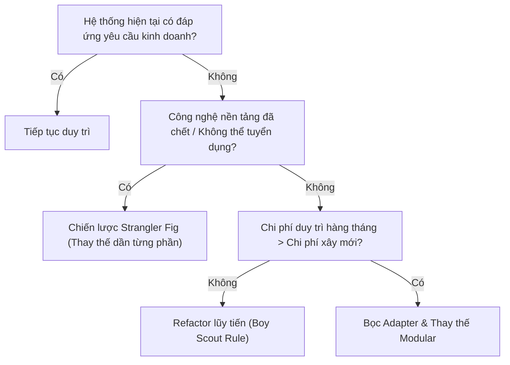

# 💸 Ảo tưởng Chi phí Chìm (The Sunk Cost Fallacy)

> *"Quá khứ là một biến số đã chết. Trong kỹ thuật, dũng cảm xóa bỏ một đoạn mã sai lầm sau 6 tháng phát triển là một chiến thắng vĩ đại, chứ không phải là sự thất bại."* — Ứng dụng **Lý thuyết Triển vọng (Prospect Theory)** của Daniel Kahneman & Amos Tversky vào quản trị kỹ nghệ phần mềm.

<!-- convention-summary-start -->

### Sunk Cost Fallacy Summary

- **The Behavioral Trap**: Con người có xu hướng tiếp tục đổ thêm nguồn lực vào một sáng kiến đang lụi tàn chỉ vì tiếc nuối những gì đã đầu tư trong quá khứ (Escalation of Commitment).
- **The Core Economic Axiom**:
  $$\text{Past Sunk Cost} = \$0 \quad (\text{Mọi chi phí trong quá khứ đều có giá trị bằng KHÔNG khi ra quyết định})$$
- **Forward-Looking Decision Equation**:
  $$EV_{\text{future}} = \sum \left( P_{\text{success}} \times \text{Value}_{\text{future}} \right) - \text{Cost}_{\text{future}}$$
  Nếu $EV_{\text{future}} \le 0$, phải dừng dự án ngay lập tức bất kể đã tiêu tốn bao nhiêu thời gian trước đó.
- **Engineering Anti-Patterns**: Cố sống cố chết duy trì framework tự chế cồng kềnh; giữ lại tính năng chỉ có $0.1\%$ người dùng tương tác; ngần ngại vứt bỏ kiến trúc microservices phân tán quá đà.
- **Remedies**: Thiết lập các cổng rẽ hướng (Pivot Gates), kỹ thuật bóp nghẹt dần (Strangler Fig Pattern), và văn hóa tôn vinh việc khai tử tính năng (Kill-Feature Celebrations).
<!-- convention-summary-end -->

---

## 1. 🧠 Nền tảng Tâm Lý Học & Cơ Chế Sợ Mất Mát (Loss Aversion)

Ảo tưởng chi phí chìm không phải là một khiếm khuyết kỹ thuật, mà là một **thiên kiến nhận thức tiến hóa (Cognitive Bias)** ăn sâu vào não bộ con người:

### ① Nỗi sợ Mất Mát (Loss Aversion - Kahneman & Tversky, 1979)
Nghiên cứu kinh tế học hành vi chứng minh rằng: **Nỗi đau mất đi 100 USD có cường độ tâm lý mạnh gấp $2 - 2.5$ lần so với niềm vui nhận được 100 USD**.
- Khi một lập trình viên hoặc Tech Lead quyết định khai tử một nhánh code mà họ đã mất 3 tháng làm thêm giờ để viết, tiềm thức của họ không nhìn nhận đó là một quyết định tối ưu hóa logic, mà xem đó là **sự mất mát trắng trợn 3 tháng cuộc đời**.
- Để trốn chạy cảm giác đau đớn và bẽ bàng này, người ta thường chọn phương án tự lừa dối bản thân: *"Chỉ cần code thêm 2 tuần nữa thôi, refactor thêm một chút nữa thôi, nó sẽ hoạt động hoàn hảo!"*.

### ② Bẫy Leo Thang Cam Kết (Escalation of Commitment - Barry Staw, 1976)
Khi con người đã công khai cam kết bảo vệ một ý tưởng hoặc giải pháp công nghệ trước mặt tập thể, cái tôi (Ego) thúc đẩy họ tiếp tục đổ thêm tiền bạc và nhân lực vào hướng đi thất bại đó nhằm chứng minh cho mọi người thấy rằng "lựa chọn ban đầu của tôi là hoàn toàn đúng đắn".

```
[Bắt đầu Dự án] ──► [Gặp Trục trặc Kỹ thuật] ──► [Tiếc Nuối Công Sức Cũ]
       ▲                                                    │
       │                                                    ▼
[Phá sản Toàn diện] ◄── [Bơm Thêm Nguồn Lực] ◄─── [Cố Chấp Chứng Minh Mình Đúng]
```

---

## 2. ⚖️ Phương Trình Quyết Định Hướng Về Tương Lai (Forward-Looking Valuation)

Trong kinh tế học và kỹ thuật lý tính, **quy tắc số một là: Quá khứ không thể đảo ngược**.

$$\text{Chi phí đã bỏ ra (Sunk Cost)} \equiv 0$$

Khi đứng trước quyết định nên tiếp tục hay dừng lại một module/tính năng, **phép tính duy nhất được phép tồn tại trên bàn đàm phán là**:

$$\text{Lợi ích Kỳ vọng Tương lai} \quad (EV) = P_{\text{thành công}} \times \text{Giá trị Tương lai} - \text{Chi phí Bổ sung Cần thiết}$$

### Bảng Phân Tích Ma Trận Quyết Định Tiến Hóa:

| Tình Huống Kỹ Thuật | Tư Duy Sai Lầm Của Chi Phí Chìm | Tư Duy Lý Tính Đúng Đắn (Forward EV) | Quyết Định Chuẩn Xác |
| :--- | :--- | :--- | :---: |
| **Hệ thống Cache tự viết bị lỗi đồng bộ** | *"Chúng ta đã mất 4 tháng phát triển nó, bây giờ mà bỏ để dùng Redis thì công sức 4 tháng qua vứt xuống sông à?"* | Tốn thêm 2 tháng để fix mà vẫn rủi ro cao. Trong khi setup Redis chỉ mất 3 ngày và hoạt động ổn định $99.99\%$. | **XÓA BỎ NGAY LẬP TỨC** |
| **Tính năng Mini-game trong app chỉ 0.5% DAU** | *"Đã ký hợp đồng mua asset 10,000 USD và dev 2 sprint, phải làm thêm pop-up quảng bá để người dùng chơi nhiều hơn."* | Chi phí bảo trì server và fix bug cho mini-game này tiêu tốn 10% capacity của team. Giá trị tạo ra cho sản phẩm chính gần như bằng 0. | **DEPRECATE & ARCHIVE** |
| **Kiến trúc Microservices tách quá vội** | *"Năm ngoái ban lãnh đạo đã duyệt ngân sách chuyển đổi sang Kubernetes và chia 15 services, giờ gộp lại thì mất mặt quá."* | Network latency cao, dev mất 30 phút để debug một flow đơn giản. Gộp về Modular Monolith tiết kiệm $40\%$ hạ tầng cloud và tăng tốc độ ship code gấp 3 lần. | **GỘP VỀ MONOLITH** |

---

## 3. ⚔️ Nan Đề Kinh Điển: "Viết Lại Toàn Bộ" (Rewrite) hay "Cải Tạo Lũy Tiến" (Refactor)?

Bẫy chi phí chìm hoạt động theo cả hai chiều:
1. **Chiều thứ nhất (Bám víu quá mức)**: Không chịu thay thế code cũ thối rữa vì tiếc công.
2. **Chiều thứ hai (Ảo tưởng viết lại từ đầu - Second-System Effect)**: Vội vã vứt bỏ toàn bộ codebase hiện tại để "viết lại từ đầu một cách hoàn mỹ".

> [!WARNING]
> **Lời Cảnh Báo của Joel Spolsky (Netscape Navigator Disaster)**:  
> Khi Netscape quyết định vứt bỏ toàn bộ codebase của Navigator 4.0 để viết lại Netscape 6.0 từ con số 0, họ đã mất **3 năm ròng rã**. Trong 3 năm đó, họ không thể thêm bất kỳ tính năng mới nào cho người dùng. Hậu quả là Internet Explorer của Microsoft đã chiếm lĩnh $90\%$ thị phần, và Netscape hoàn toàn bị tiêu diệt.  
> Codebase cũ trông có vẻ bừa bộn và phức tạp, nhưng bên trong nó chứa đựng hàng nghìn bài học xương máu và các đoạn vá lỗi biên (Edge Cases) mà một bản viết lại từ đầu không thể lường trước được.

### Khung Đánh Giá Lựa Chọn Kỹ Thuật (Decision Framework):



---

## 4. 🏢 Nghiên cứu Tình huống Thực tế (Industry Case Studies)

### Case Study 1: Microsoft Khai Tử EdgeHTML để Chuyển Sang Chromium (2018)
Microsoft đã đầu tư hàng tỷ USD và hàng thập kỷ kỹ nghệ liên tục từ Internet Explorer đến trình duyệt Edge với engine dựng hình riêng (EdgeHTML). 
- Tuy nhiên, hệ sinh thái web đã chuyển dịch hoàn toàn sang WebKit/Chromium. Kỹ sư Microsoft phải liên tục chạy đua trong vô vọng để vá lỗi tương thích với các chuẩn web mới.
- **Quyết định dũng cảm**: Năm 2018, Satya Nadella và đội ngũ kỹ thuật Microsoft đã đưa ra quyết định gây chấn động: **Vứt bỏ hoàn toàn EdgeHTML** và tái thiết kế trình duyệt Edge trên nền tảng mã nguồn mở Chromium của Google.
- **Kết quả**: Microsoft tiết kiệm hàng triệu giờ công mỗi năm, trình duyệt Edge mới nhanh hơn, mượt mà hơn, tương thích $100\%$ tiện ích Chrome và lấy lại thị phần đáng kể.

### Case Study 2: Google & Nghĩa Trang Sản Phẩm (Google Graveyard)
Google nổi tiếng với việc kiên quyết "khai tử" các dự án dù đã đầu tư khổng lồ nếu chúng không đạt ngưỡng tăng trưởng kỳ vọng:
- Google Wave (nền tảng cộng tác đột phá tiêu tốn hàng năm trời của đội ngũ Google Maps).
- Google Reader, Google+, Google Stadia (nền tảng game đám mây được đầu tư hàng trăm triệu USD về phần cứng và trung tâm dữ liệu).
- Dù việc đóng cửa gây tiếc nuối cho cộng đồng người dùng trung thành, văn hóa này giải phóng hàng nghìn kỹ sư ưu tú khỏi các dự án ngõ cụt để dồn toàn lực cho Android, Cloud, và Trí tuệ Nhân tạo (Gemini).

---

## 5. 🛠️ Actionable Implementation Playbook cho Dự án Ineffable

### ① Quy Chế Thử Nghiệm Kỹ Thuật (Spike Task Timeboxing)
Khi đối mặt với các công nghệ hoặc giải pháp chưa chắc chắn (ví dụ: giải thuật đồng bộ WebRTC, thư viện canvas mới cho boardgame):
1. **Tạo Task với Capacity `SPIKE`**:
   - Ghi rõ mục tiêu và giả thuyết cần kiểm chứng.
   - Thiết lập thời gian khóa cứng (Timebox): **Tối đa 3 ngày**.
2. **Quy Tắc "Burn on Failure"**:
   - Nếu sau 3 ngày mà PoC (Proof of Concept) không chứng minh được tính khả thi hoặc bộc lộ lỗi nghiêm trọng: **Xóa ngay nhánh git đó**.
   - Không được phép nói: *"Dù sao cũng mất 3 ngày rồi, cố nốt tuần này xem sao"*.

### ② Mẫu Thiết Kế Bóp Nghẹt (Strangler Fig Pattern)
Khi cần thay thế một module cũ lỗi thời trong Ineffable:

```
[Client / API Gateway]
          │
          ▼ (Routing via Feature Flag)
   ┌──────────────┐
   │ Reverse Proxy│
   └──────┬───────┘
          ├─────────────────────────┐
          │ (80% Traffic)           │ (20% Canary Traffic)
          ▼                         ▼
   ┌──────────────┐          ┌──────────────┐
   │ Legacy Module│          │  New Module  │
   │ (Cũ, cồng    │          │  (Sạch, test │
   │  kềnh)       │          │   đầy đủ)    │
   └──────────────┘          └──────────────┘
```

1. Tạo Module mới chạy song song độc lập.
2. Sử dụng Feature Flag chuyển dần $10\% \to 50\% \to 100\%$ lưu lượng người dùng sang module mới.
3. Khi module mới vận hành ổn định $100\%$: **Tiến hành xóa sạch (Purge) toàn bộ code của Module cũ khỏi repository**, không để lại bất kỳ đoạn code chết nào.

### ③ Lễ Tuyên Dương "Khai Tử Mã Nguồn" (Dead Code Purge Celebration)
- Trong các buổi Sprint Review, trao giải danh dự cho kỹ sư có PR **xóa được nhiều dòng code nhất** mà hệ thống vẫn chạy ổn định.
- Mỗi dòng code bị xóa là bớt đi một gánh nặng bảo trì, bớt đi một nguy cơ bảo mật và giải phóng không gian tư duy cho toàn đội.

---

## 6. 📋 Audit Checklist & Bộ Câu Hỏi Tự Vấn (Self-Assessment)

Trước khi tiếp tục cấp thêm ngân sách hoặc thời gian cho một tính năng/module đang gặp khó khăn:

- [ ] **Phép Thử Ngày Mai**: Nếu hôm nay toàn bộ code của tính năng này bị xóa sạch và bạn phải bắt đầu lại từ con số 0 với những gì bạn đã biết bây giờ, **bạn có chọn viết lại chính nó không**? (Nếu câu trả lời là "Không" $\implies$ Hãy dừng nó ngay bây giờ!).
- [ ] **Bóc Tách Cái Tôi (Ego Separation)**: Bạn đang cố gắng hoàn thành giải pháp này vì nó thực sự mang lại giá trị cho người dùng, hay chỉ vì bạn muốn chứng minh rằng mình đã không chọn sai công nghệ từ 3 tháng trước?
- [ ] **Chi Phí Cơ Hội (Opportunity Cost)**: Nếu team dừng ngay dự án này trong tuần này, chúng ta có thể dùng thời gian đó để làm tính năng nào khác mang lại giá trị cao hơn gấp $5\times$?
- [ ] **Đo Lường Telemetry**: Quyết định duy trì tính năng này dựa trên số liệu phân tích người dùng thực tế hay dựa trên cảm tính cá nhân của một vài cá nhân trong team?
- [ ] **Quy Trình Sunset Rõ Ràng**: Đội ngũ đã có quy trình hạ cờ (Deprecation) và thông báo di dời tính năng cho người dùng một cách chuyên nghiệp chưa?
