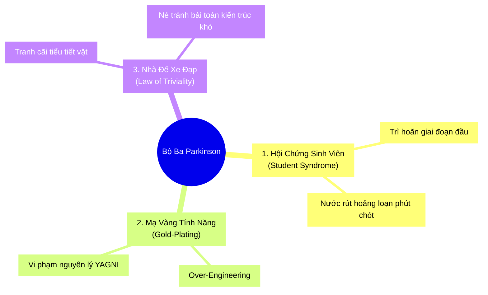

# ⏳ Định luật Parkinson (Parkinson's Law)

> *"Công việc luôn tự động phình to ra để lấp đầy toàn bộ khoảng thời gian được ấn định cho nó."* — **Cyril Northcote Parkinson** (1955).  
> *"Nếu bạn cho một lập trình viên 2 ngày để làm một tính năng, họ sẽ hoàn thành trong 2 ngày. Nếu bạn cho họ 2 tuần, họ cũng sẽ mất đúng 2 tuần!"*

<!-- convention-summary-start -->

### Parkinson's Law Summary

- **The Elasticity of Work**: Khối lượng công việc không phải là một đại lượng cố định. Thời gian cho phép càng rộng, con người càng có xu hướng trì hoãn ở giai đoạn đầu (Student Syndrome) và phức tạp hóa giải pháp ở giai đoạn cuối (Gold-Plating).
- **The Deadly Trio of Inefficiency**:
  1. `Student Syndrome`: Tâm lý nước đến chân mới nhảy; thời gian ban đầu bị lãng phí vì cảm giác deadline còn xa.
  2. `Gold-Plating`: Tự ý thêm thắt các chi tiết hoa mỹ, hiệu ứng thừa thãi vượt ngoài đặc tả yêu cầu của sản phẩm.
  3. `Bike-Shedding (Law of Triviality)`: Tranh luận hàng giờ về những tiểu tiết vô thưởng vô phạt (như màu nút bấm, cách đặt tên biến) trong khi bỏ qua các bài toán kiến trúc sống còn.
- **The Counter-Weapon**: **Kỹ thuật Khóa Thời Gian (Timeboxing)** kết hợp nguyên tắc **Cố định Thời gian, Linh hoạt Phạm vi (Fixed Time, Variable Scope)**.
<!-- convention-summary-end -->

---

## 1. 📜 Nguồn Gốc Lịch Sử & Thí Nghiệm Quản Trị

Năm 1955, nhà sử học và kinh tế học người Anh Cyril Northcote Parkinson đã công bố bài tiểu luận gây tiếng vang trên tạp chí *The Economist*. Ông phân tích số liệu thống kê của Bộ Hải quân Hoàng gia Anh (British Admiralty) và chỉ ra một sự thật kinh ngạc:
- Từ năm 1914 đến năm 1928, số lượng tàu chiến của hải quân Anh giảm **$67\%$**, số lượng thủy thủ giảm **$31\%$**.
- Thế nhưng, số lượng quan chức và nhân viên hành chính tại trụ sở bộ lại tăng vọt **$78\%$**!
- Công việc bàn giấy tự sinh sôi nảy nở để mọi công chức đều bận rộn từ sáng đến tối, dù số lượng tàu thực chiến trên biển giảm mạnh.

Trong kỹ nghệ phần mềm, định luật Parkinson tác động trực tiếp vào tâm lý của kỹ sư thông qua mối quan hệ giữa **Thời gian được phân bổ (Allotted Time)** và **Giải pháp Kỹ thuật được lựa chọn**:

```
Độ Phức Tạp ▲
Giải Pháp   │                                                /  Elasticsearch +
            │                                               /   Kafka + Microservices
            │                                              /    (Nếu cho 1 tháng!)
            │                                             /
            │                                _ ── ─ ─ ─ ─
            │                      _ ── ─ ─ ─  (Redis Cache + Fulltext Search)
            │            _ ── ─ ─ ─  (Nếu cho 1 tuần)
            │  ─────────  (SELECT LIKE %)
            │  (Nếu cho 2 ngày)
            └────────────────────────────────────────────────────────►
            0           2 ngày        1 tuần                 1 tháng
                               Thời Gian Được Giao (Deadline)
```

---

## 2. 💣 Bộ Ba Hủy Diệt Năng Suất Trong Đội Ngũ Kỹ Thuật



### ① Hội Chứng Sinh Viên (Student Syndrome - Eliyahu Goldratt)
Khi một kỹ sư được giao 2 tuần cho một task mà họ biết chỉ cần 3 ngày để code:
- **Tuần 1**: Kỹ sư cảm thấy thời gian còn rất thênh thang. Họ dành thời gian lướt Reddit, dọn dẹp bàn làm việc, tham gia vào mọi cuộc tranh luận trên Slack, hoặc nghiên cứu những công nghệ không liên quan.
- **Tuần 2 (3 ngày cuối)**: Bắt đầu hoảng loạn khi nhận ra deadline đã cận kề. Lúc này, nếu có bất kỳ biến cố bất ngờ nào xảy ra (máy dev hỏng, server dev lỗi), dự án lập tức vỡ trận và trễ hạn!

### ② Mạ Vàng Tính Năng (Gold-Plating & Premature Optimization)
> *"Premature optimization is the root of all evil."* — Donald Knuth.  
Khi deadline quá hào phóng, lập trình viên sẽ bị thôi thúc bởi "chủ nghĩa hoàn hảo vô ích":
- Viết một hệ thống cache đa tầng phức tạp cho một bảng dữ liệu chỉ có đúng 50 dòng.
- Viết engine animation tùy biến phức tạp thay vì dùng một thư viện CSS có sẵn.
- **Hậu quả**: Codebase phình to vô ích, tăng diện tích bề mặt lỗi (Bug Surface Area) và tạo ra hàng núi nợ kỹ thuật cho người đến sau.

### ③ Hiện Tượng Nhà Để Xe Đạp (Bike-Shedding / Parkinson's Law of Triviality)
Parkinson đưa ra một ví dụ châm biếm kinh điển:
- Một ủy ban được giao phê duyệt ngân sách cho hai dự án:
  1. **Dự án xây dựng Nhà máy Điện Hạt nhân (100 triệu USD)**: Cuộc họp chỉ kéo dài **15 phút** vì vấn đề quá lớn và phức tạp, không ai dám tỏ ra mình hiểu sâu nên tất cả đều nhanh chóng gật đầu thông qua.
  2. **Dự án xây Nhà để Xe đạp cho nhân viên (500 USD)**: Cuộc họp kéo dài suốt **3 giờ đồng hồ** với những cuộc cãi vã nảy lửa về việc: *"Mái tôn nên sơn màu xanh lá cây hay màu xanh da trời?"*, bởi vì vấn đề này ai cũng có ý kiến và ai cũng hiểu được!
- **Trong lập trình**: Đội ngũ có thể dành 2 ngày họp để tranh cãi xem nên dùng dấu nháy đơn (`'`) hay nháy kép (`"`) trong file JavaScript, nhưng lại chỉ lướt qua trong 5 phút một PR làm thay đổi toàn bộ thuật toán thanh toán ngân hàng!

---

## 3. 🛡️ Vũ Khí Tối Thượng: Nghệ Thuật Khóa Thời Gian (Timeboxing)

Giải pháp khoa học duy nhất để bẻ gãy định luật Parkinson là **áp dụng kỷ luật Timeboxing nghiêm ngặt**:

```
MÔ HÌNH TRUYỀN THỐNG (Waterfall/Parkinson)     MÔ HÌNH TIMEBOXING (Modern Agile)
┌──────────────────────────────────────┐     ┌──────────────────────────────────────┐
│  Phạm Vi (Scope):     CỐ ĐỊNH        │     │  Thời Gian (Time):   CỐ ĐỊNH 🔒      │
│  Thời Gian (Time):    KÉO DÃN        │     │  Chất Lượng (Quality): CỐ ĐỊNH 🔒     │
│  Chất Lượng (Quality): BỊ BÀO MÒN    │     │  Phạm Vi (Scope):    LINH HOẠT ✂️     │
└──────────────────────────────────────┘     └──────────────────────────────────────┘
```

### Nguyên Lý Vận Hành:
1. **Khóa Cứng Khung Thời Gian**: Không bao giờ thay đổi ngày kết thúc của Sprint (ví dụ: chu kỳ 2 tuần luôn luôn kết thúc đúng vào chiều thứ Sáu).
2. **Khi Hết Giờ (Timebox Expiration)**:
   - Nếu công việc chưa xong toàn bộ: **Không bao giờ kéo dài thêm thời gian**.
   - Thay vào đó, **cắt tỉa những phần chưa xong** và chỉ phát hành những gì đã hoàn thiện và vượt qua test.

---

## 4. 🏢 Nghiên cứu Tình huống Thực tế (Industry Case Studies)

### Case Study: Basecamp & Phương Pháp Luận "Shape Up"
Công ty phần mềm nổi tiếng 37signals (Basecamp, HEY) từng nhiều lần đối mặt với các dự án kéo dài lê thê hàng tháng mà không đi đến đâu.
- **Giải pháp Shape Up**: Họ hủy bỏ hoàn toàn các sprint ngắn 2 tuần vô định và thay thế bằng chu kỳ **6-Week Cycles (Chu kỳ 6 tuần cứng)**.
- **Quy tắc "Circuit Breaker" (Cầu dao ngắt tự động)**:
  - Một nhóm kỹ sư gồm 2 dev và 1 designer được giao 6 tuần để hoàn thành một tính năng đã được phác thảo (Shaped).
  - Nếu sau 6 tuần mà tính năng chưa thể phát hành: **Dự án bị hủy bỏ mặc định (The project is killed by default)**!
  - Không có chuyện "cho chúng tôi xin thêm 1 tuần để làm nốt". Nhóm phải quay trở lại bàn thiết kế để xem tại sao giải pháp của mình lại cồng kềnh như vậy.
- **Kết quả**: Áp lực của chiếc cầu dao ngắt tự động buộc các kỹ sư phải liên tục tự tay cắt gọt các chi tiết thừa thãi và tập trung $100\%$ vào giải pháp đơn giản nhất hoạt động được.

---

## 5. 🛠️ Actionable Implementation Playbook cho Dự án Ineffable

### ① Định Nghĩa Hoàn Thành (Definition of Done - DoD) Làm Rào Chắn Chống Mạ Vàng
Kỹ sư trong Ineffable chỉ được phép code theo đúng **Acceptance Criteria (Tiêu chí Chấp thuận)** trong issue GitHub:
- Cấm tự ý thêm các cài đặt (settings/options) khi chưa có sự thống nhất trong RFC/Issue.
- Mọi pull request vượt ra ngoài phạm vi mô tả của Issue sẽ bị reviewer yêu cầu tách sang một Issue mới thay vì gộp chung vào PR hiện tại.

### ② Timebox Cho Các Cuộc Họp Và Tranh Luận Kỹ Thuật
Để tránh bẫy Nhà Để Xe Đạp (Bike-shedding):
- **Tranh luận Code Style**: Giao $100\%$ quyền lực cho linter tự động (`eslint`, `prettier`, `lint_paths`). Nếu linter không báo lỗi thì không tranh cãi trên PR!
- **Họp Kỹ Thuật / RFC**: Mỗi chủ đề thảo luận có timebox tối đa **30 phút**. Nếu hết 30 phút mà chưa đạt đồng thuận, Tech Lead có quyền quyết định cuối cùng (Disagree and Commit).

### ③ Nguyên Tắc YAGNI (You Aren't Gonna Need It)
- Không bao giờ xây dựng một cấu trúc dữ liệu hoặc một tầng trừu tượng (Abstraction Layer) chỉ vì nghĩ rằng: *"Có thể 6 tháng nữa khách hàng sẽ cần tính năng này"*.
- Chỉ viết code phục vụ cho nhu cầu của ngày hôm nay. Khi nào có nhu cầu thực tế mới tiến hành refactor.

---

## 6. 📋 Audit Checklist & Bộ Câu Hỏi Tự Vấn (Self-Assessment)

- [ ] **Kỷ Luật Sprint**: Đội ngũ của bạn có bao giờ kéo dài thời gian của Sprint thêm vài ngày để "chờ merge nốt một task" không? (Nếu có $\implies$ Bạn đang hủy hoại giá trị của Timebox!).
- [ ] **Kiểm Soát Gold-Plating**: Trong PR gần nhất, bạn có viết đoạn code nào mà Acceptance Criteria không hề yêu cầu không?
- [ ] **Tiêu Diệt Bike-Shedding**: Có cuộc họp hay PR comment nào trong tuần qua tranh luận quá 20 phút về một vấn đề không ảnh hưởng đến kiến trúc hoặc trải nghiệm người dùng không?
- [ ] **Triệt Tiêu Student Syndrome**: Các commit trong sprint có được thực hiện đều đặn mỗi ngày hay dồn ứ $80\%$ vào 2 ngày cuối cùng của sprint?
- [ ] **Tôn Trọng Sự Đơn Giản**: Bạn có cảm thấy tự hào khi giải quyết được một vấn đề hóc búa bằng một đoạn script ngắn đơn giản thay vì phải dựng lên một kiến trúc phức tạp không?
